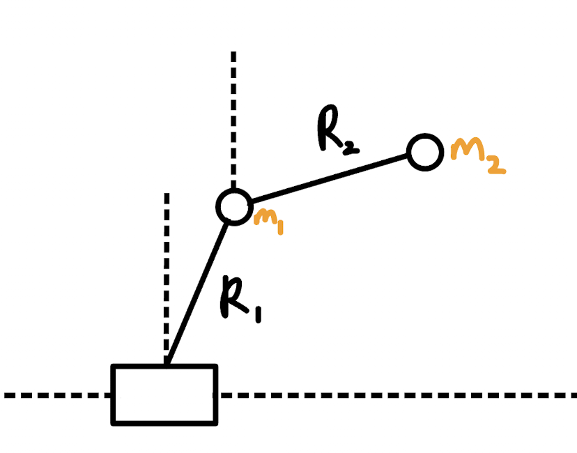
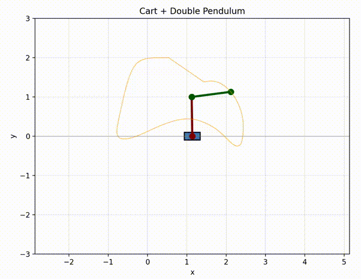
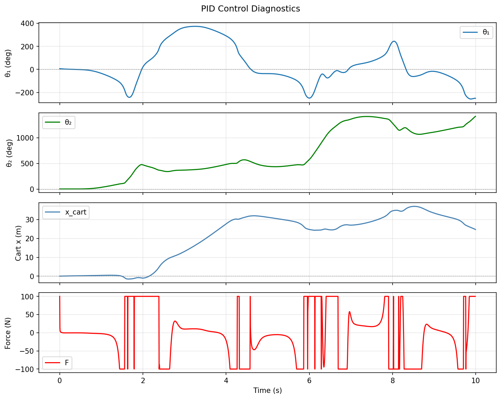
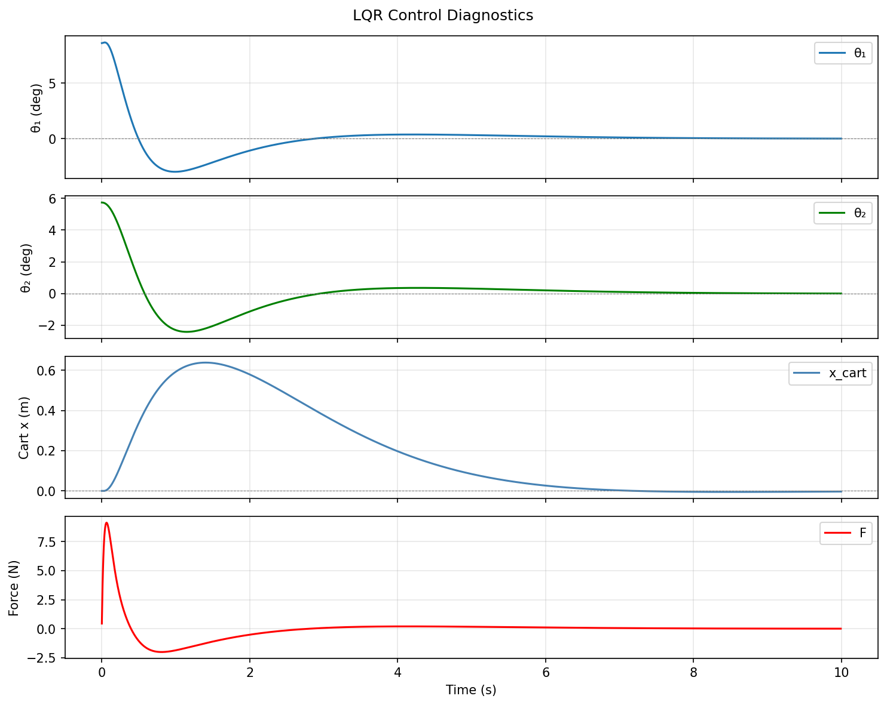
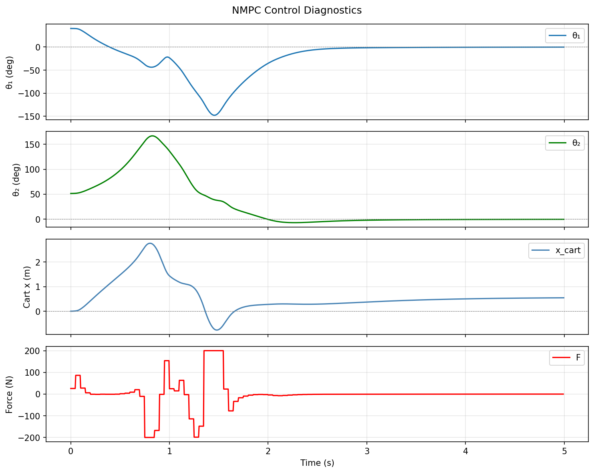

# Cart-Double Pendulum Control





Simulation and control of an inverted double pendulum on a cart using three different control strategies (PID, LQR, nonlinear MPC).

## System

A cart (mass `m_c`) moves along a horizontal rail. Two rigid links (masses `m_1`, `m_2`, lengths `L_1`, `L_2`) are connected in series from the cart. The only control input is a horizontal force `F` applied to the cart. The goal is to balance both links in the inverted (upright) position.

The dynamics for the system were generated through symbolic calculation of the Euler-Langrange equations, to which the equations of motion were then derived and implemented in the simulation.

- **State**: `[x_c, θ_1, θ_2, ẋ_c, θ̇_1, θ̇_2]`
- **Control input**: `F` (force on cart)
- **Convention**: `θ = 0` is the upright (inverted) equilibrium.

Equations of motion are derived using Lagrangian mechanics via SymPy, then lambdified for fast numerical evaluation.

## Controllers

### PID (`double_pendulum_pid.py`)
Three independent PID controllers (cart position, θ_1, θ_2) sum their outputs to produce the cart force. Includes angle wrapping. Works for small perturbations from vertical.

### LQR (`double_pendulum_lqr.py`)
Linearizes the dynamics around the inverted equilibrium using numerical finite differences to obtain the A and B matrices. Solves the continuous algebraic Riccati equation for optimal feedback gain K. Works for small perturbations (10-15°).

### Nonlinear MPC (`double_pendulum_nmpc.py`)
Optimal control using the full nonlinear dynamics. At each control step, optimizes a sequence of N control inputs to minimize a quadratic state/input cost. Uses scipy minimize with SLSQP algorithm and warm-starting. Handles larger deviations than LQR.

## Files

| File | Description |
|------|-------------|
| `double_pendulum_pid.py` | Simulation with PID control |
| `double_pendulum_lqr.py` | Simulation with LQR control |
| `double_pendulum_nmpc.py` | Simulation with NMPC control |
| `pid.py` | PID controller class |
| `lqr.py` | LQR controller class |
| `nmpc.py` | NMPC controller class |

## Results

### PID


### LQR


### NMPC


## Dependencies

- Python 3
- NumPy
- SciPy
- SymPy
- Matplotlib
- casadi

## Usage

Run any simulation script directly:

```bash
python double_pendulum_pid.py
python double_pendulum_lqr.py
python double_pendulum_nmpc.py
```

